# Product Catalog

A Flutter app that lists products from the [DummyJSON](https://dummyjson.com/docs/products) API and shows each one in detail. It was built for the Best Practice Flutter Test.

## Download for Android

Scan the code with your phone's camera, or tap the link on your phone, to download the APK.

<a href="https://github.com/GeeksEra/product_catalog/raw/main/apk/product-catalog.apk"></a>

**[Download product-catalog.apk](https://github.com/GeeksEra/product_catalog/raw/main/apk/product-catalog.apk)** (17 MB, version 1.0.0)

- Needs Android 7.0 or later on a 64-bit ARM phone, which covers almost every phone from recent years.
- The app isn't on Google Play, so Android asks you to allow installs from your browser or file manager the first time. Open the downloaded file and follow the prompt.
- It's a release build signed with the Flutter debug key, which is fine for trying it out. An update signed with a different key would need the old version uninstalled first.

## Features

**App shell**
- A frosted bottom tab bar with **Products** and **Settings**. Each tab keeps its own navigation stack and scroll position, and the bar stays visible on the detail screen
- Tapping the current tab again pops back to its first screen, then scrolls it to the top
- Android back (with Android 14 predictive back): closes the keyboard, cancels an active search, goes back within the current tab, then returns to Products, then leaves the app

**Product list**
- An iOS-style large title that folds into a compact bar as you scroll. The search field hides on scroll and settles fully open or closed when you let go
- Focusing search slides the title away, pins the field at the top and shows **Cancel**. Filter chips stay pinned under the bar
- Tapping the selected chip again scrolls back to the top. Picking another chip starts the new list at the top
- Shows the title, brand (only when the product has one), a two-line description, price with discount, star rating, a stock badge and the thumbnail
- Availability is derived from `stock`, as the brief asks: `stock > 0` shows "In Stock", otherwise "Out of Stock"
- Infinite scroll using `limit` and `skip`, with **skeleton cards while the next page loads** and an end-of-list line ("That's all 194 products")
- Pull to refresh keeps the current list on screen until the new first page arrives, and says so if it fails: the iOS spinner on iPhone, the Material one on Android
- Search with a 400 ms debounce and a result count, and a filter row with one chip per category
- One column on phones, and a two- or three-column grid on tablets and in landscape. On short screens (a phone in landscape) the title sits in the compact bar, so the list keeps its room
- Shimmer skeletons while loading, an error view with Retry, and an empty state for searches with no results

**Product detail**
- A full-bleed, swipeable gallery of all images that collapses into a titled bar as you scroll. Tap an image to open a full-screen viewer with pinch to zoom
- Title, brand, category, price and savings, plus a row with rating, stock left and discount
- Reviews with an overall rating summary (see [Decisions](#decisions-and-assumptions))
- A QR code card: the `meta.qrCode` image from the API, plus a QR code generated on the device from the barcode. Tap either code to show it full screen on white, sized for scanning

**Bonus**
- ✅ Pagination: `limit` / `skip`
- ✅ Search **and** category filtering
- ✅ Animations: Hero from the thumbnail into the gallery, press-scale on cards, staggered fade-in of list items, and animated transitions between states
- ✅ Light and dark mode: pick System, Light or Dark on the Settings tab. The choice is saved across launches

**Settings**
- Appearance: three previews (System, Light, Dark) drawn in the app's real palettes
- App version and build number, and the data source

## Demo

A walkthrough recorded on the iPhone simulator against the live API: first load, the collapsing header, loading more, search and a search with no results, the category filter, the product detail with its gallery, the QR code full screen, and switching themes in Settings.

<a href="docs/demo.mp4"></a>

[Watch the full-quality video (MP4)](docs/demo.mp4)

## Screenshots

| List | Scrolled: search hidden, title folded | Loading the next page |
|---|---|---|
| 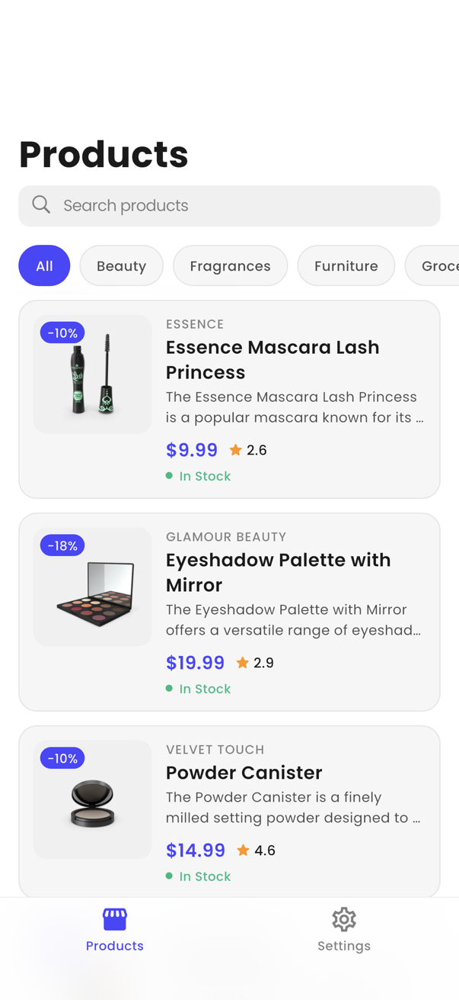 | 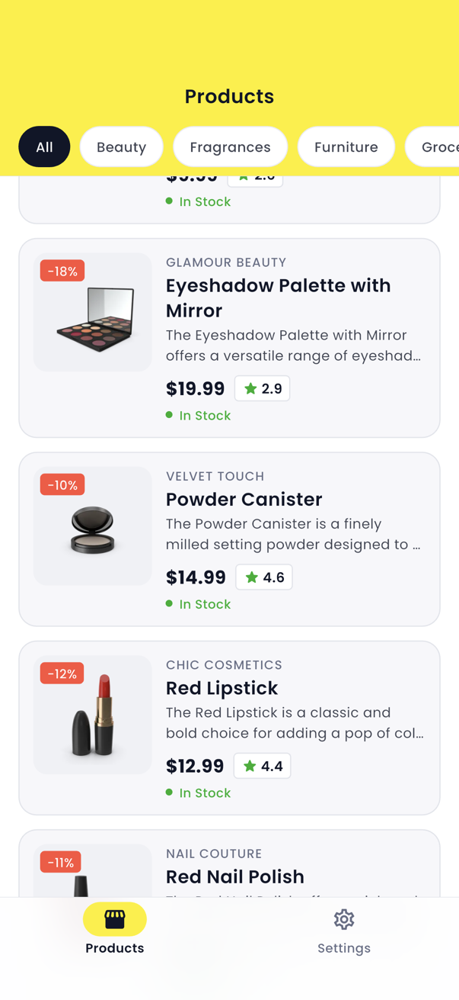 | 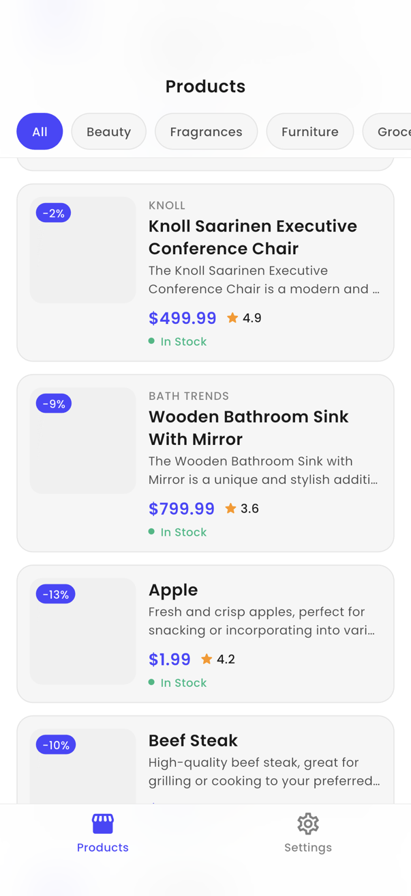 |

| List (dark) | Search active | No results |
|---|---|---|
| 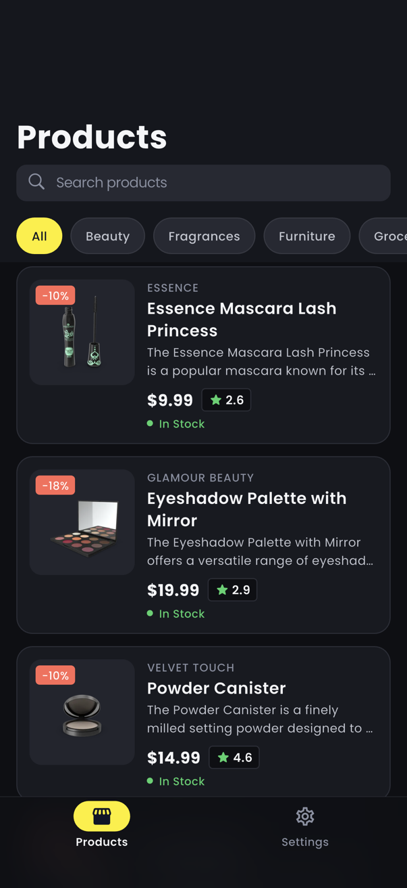 | 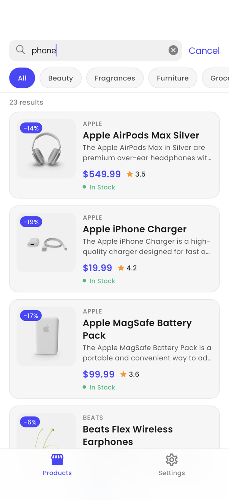 | 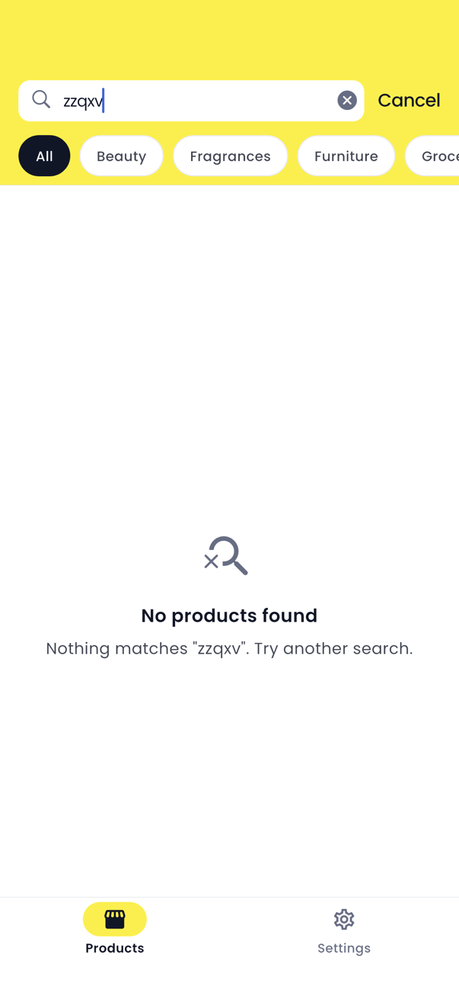 |

| Category filter | Detail | Reviews and QR code |
|---|---|---|
| 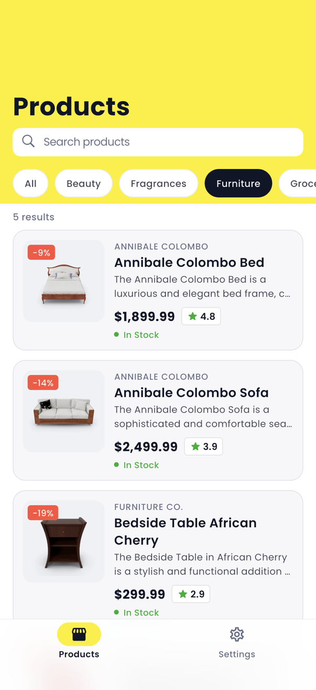 | 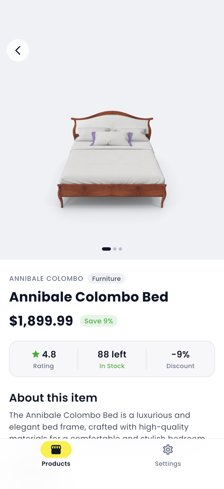 | 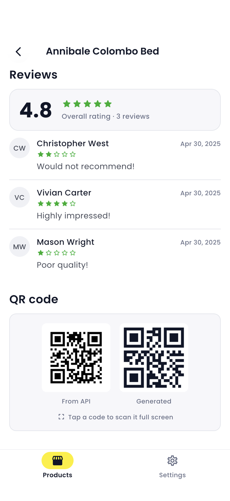 |

| QR code full screen | Detail (dark) | Settings |
|---|---|---|
| 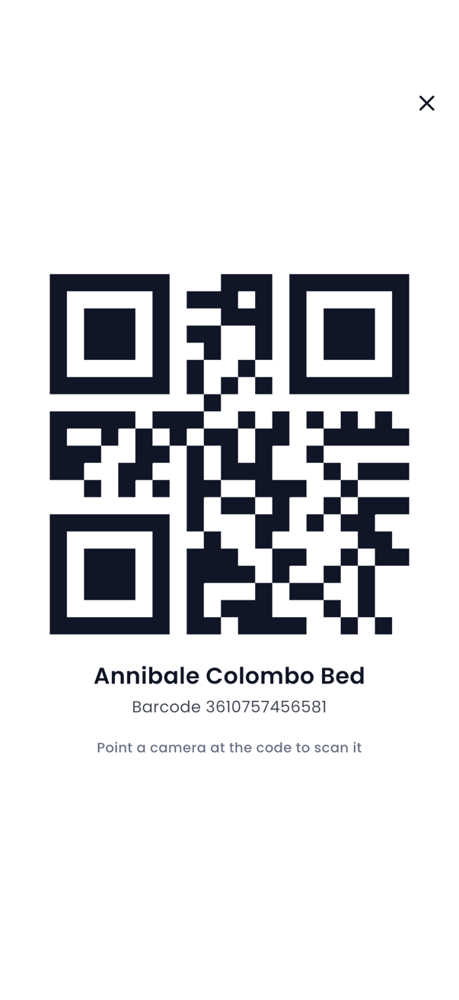 | 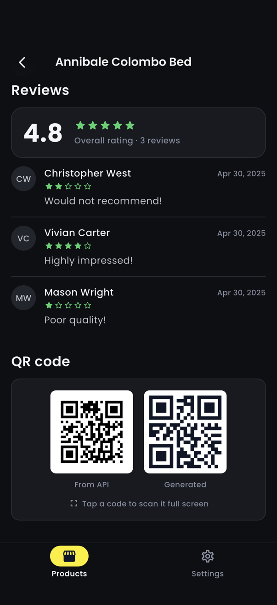 | 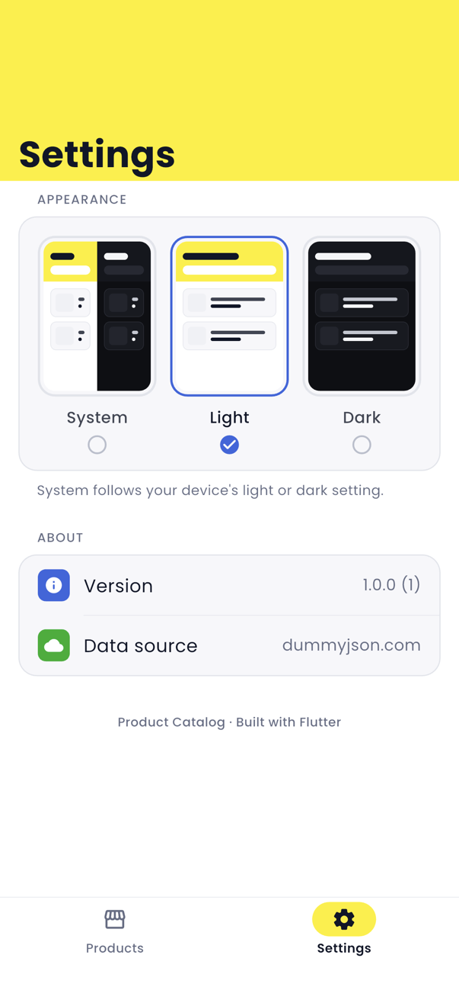 |

| Settings (dark) |
|---|
| 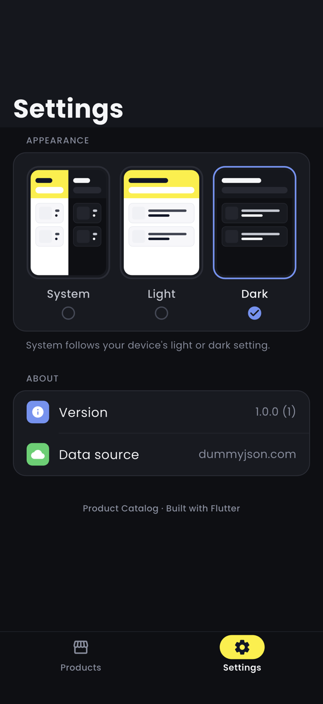 |

The integration test captures these screenshots from the running app (see [Testing](#testing)).

## How to run

Requirements: Flutter stable (built and tested with **Flutter 3.41.9 / Dart 3.11.5**), and Xcode or Android Studio for a simulator or emulator. iOS requires 15.0 or later.

```sh
flutter pub get
flutter run
```

To rebuild the downloadable APK and its QR code (`apk/product-catalog.apk` and `docs/apk-qr.svg`):

```sh
tool/build_apk.sh
```

The generated `*.g.dart` files (MobX stores and JSON models) are committed, so no code generation is needed to run the app. If you change a model or store, regenerate them:

```sh
dart run build_runner build --delete-conflicting-outputs
```

## APIs used

Base URL: `https://dummyjson.com`

| Purpose | Endpoint | Parameters |
|---|---|---|
| Product list | `GET /products` | `limit`, `skip`, `select` |
| Search | `GET /products/search` | `q`, `limit`, `skip`, `select` |
| Category list | `GET /products/categories` | none |
| Products in a category | `GET /products/category/{slug}` | `limit`, `skip`, `select` |
| Product detail | `GET /products/{id}` | none |

List requests send `select=` with only the fields the card shows. This leaves reviews, images and other detail-only data out of every page. The detail screen then fetches the full product.

## Architecture

```
lib/
├── main.dart            # sets up dependency injection, then runApp
├── app.dart             # MaterialApp; rebuilds when the theme mode changes
├── config/              # API endpoints and settings; get_it service locator
├── theme/               # design tokens: colors (light/dark), text styles, spacing, ThemeData
├── models/              # Product, ProductPage, Review, ProductMeta, Category (json_serializable)
├── services/            # ApiClient (wraps http), typed ApiException, ProductService
├── stores/              # MobX stores: product list, product detail, theme
├── screens/             # home (tab shell), product_list, product_detail, settings, image_viewer
└── widgets/             # reusable UI: large-title header, tab bar, card, shimmer, gallery, QR card, …
```

Dependencies point one way only: **screens → stores → services → models**. Models import nothing else from the app. Widgets receive data and callbacks through their constructors and never read stores directly.

| Concern | Choice | Why |
|---|---|---|
| HTTP | `http` | The package the brief names. `ApiClient` adds the base URL, a 15 s timeout, status checks and JSON decoding, and turns every failure into a sealed `ApiException` (`NetworkException`, `ServerException`, `ParseException`) |
| State | MobX (`mobx`, `flutter_mobx`) | Observable state and derived values with very little boilerplate. The detail screen's loading, error and loaded states come from an `ObservableFuture` |
| Dependency injection | `get_it` | `ProductService` is an interface, so stores can be tested against a mock |
| Pagination | `infinite_scroll_pagination` v4 | Handles page requests, first-page and next-page loading and error states, and the empty state |
| Models | `json_serializable` | Fields that can be missing, such as `brand`, are nullable. Fields left out of list responses have defaults |
| Images | `cached_network_image` | Images are cached, and thumbnails are decoded at display size |
| App info | `package_info_plus` | The version and build number on the Settings tab |

A few details worth knowing:
- **Stale responses are dropped.** Changing the search or the category starts a new request generation. A page that arrives from an older generation is ignored, so fast typing can't show results for an old query.
- **The detail screen opens instantly.** It draws the header from the product it was given by the list, so the Hero image and the title appear at once. Only the reviews and QR section wait for the network.
- **Tabs keep their state.** Each tab is its own `Navigator` inside an `IndexedStack`, with its own `HeroController` so the list-to-detail Hero still flies. Animations on the hidden tab are paused.
- **Design tokens.** Every widget gets its colors from `AppColors`, a `ThemeExtension` with light and dark palettes, and its text styles from `AppText`. The palette is taken from noon.com: the yellow top bar (`#FEEE00`) with navy text, blue links (`#3866DF`), green ratings and in-stock labels (`#05AF25`) and coral deal tags (`#FE503C`). noon has no dark mode, so the dark palette keeps those accents on deep navy greys. No raw hex values or `Colors.*` appear in widgets. The one exception is the black background behind the full-screen image viewer.

## Testing

```sh
flutter analyze   # no issues, with flutter_lints plus stricter rules
flutter test      # unit and widget tests
```

| Area | What is covered |
|---|---|
| `test/models` | JSON parsing with and without `brand`, defaults for fields list responses leave out, whole-number prices, `inStock`, `hasMore` |
| `test/services` | Query parameters and paths for every endpoint, and mapping of errors to typed exceptions (500, 404, invalid JSON, wrong field types, no connection, timeout). Uses `MockClient` from `package:http/testing.dart` |
| `test/stores` | Pagination, the last page, errors, debounced search, search and category clearing each other, dropping stale responses, category retry, placeholder reviews, detail retry, saving the theme |
| `test/widgets` | The product card renders every field, hides a missing brand, shows out of stock, handles taps, and fits a 320 px screen at 1.3× text size |
| `test/widgets/qr_code_card_test` | Tapping a code asks to open it; the full-screen viewer shows the code, product and barcode, and closes |
| `test/screens` | Skeleton cards while the next page loads and the end-of-list line after it; re-tapping the selected chip scrolls to the top; focusing search shows Cancel, and Cancel ends the search; on Settings the app keeps the Android back gesture and back returns to Products |

An end-to-end test runs the real app against the live API. It browses and scrolls the list, loads more, re-taps a chip, searches and cancels, filters by category, opens a product, scrolls to the QR code, and switches to Dark on the Settings tab, taking the screenshots above along the way:

```sh
flutter drive --driver=test_driver/integration_test.dart \
  --target=integration_test/app_flow_test.dart
```

The demo video comes from a second, slower walkthrough. Its script records the simulator and writes `docs/demo.mp4` and `docs/demo.gif` (needs `ffmpeg`):

```sh
tool/record_demo.sh
```

## Decisions and assumptions

- **Availability comes from `stock`**, not from the API's `availabilityStatus`, as the brief asks.
- **Brand is optional.** Roughly half of the catalog has no `brand`, so the card and detail screen show it only when it's present.
- **Reviews.** The brief asks for simulated reviews. DummyJSON already returns real reviews for each product, so the app shows those. When a product has none, it falls back to built-in sample reviews and labels them as samples.
- **QR code.** `meta.qrCode` is the same placeholder image for every product. The app shows it as required, and next to it shows a real QR code generated on the device from `meta.barcode`.
- **Search and category are exclusive.** DummyJSON can't combine them in one request, so choosing a category clears the search and typing a search clears the category.
- **Prices** are shown in USD, as the API returns them. The discount appears as a percentage label; no "original price" is worked out from it.

## What I'd do next

- An offline cache for the last loaded pages
- Golden tests for the card and the detail screen, in both themes
- Build flavors for different API environments
- Localization. All user-facing strings are currently in the widgets
